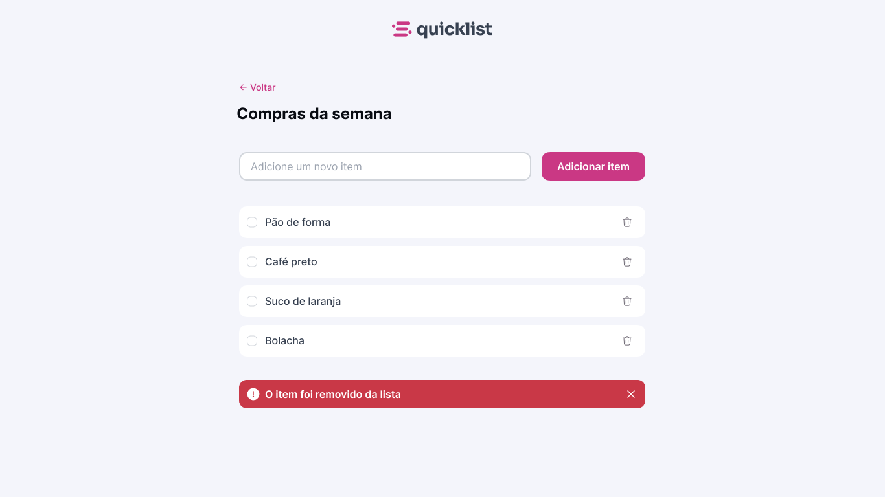

# Quicklist App

A clean and responsive web application for managing a weekly shopping list using HTML, CSS, and JavaScript.

## Features

- Add new items to the shopping list.
- Remove individual items from the list.
- Visual feedback when an item is removed.
- Minimalist and responsive design.

## Technologies

- HTML5
- CSS3
- JavaScript (Vanilla)

## Project Structure

```
quicklist-app/
│
├── index.html            # Main HTML file
├── styles/
│   └── style.css         # CSS styles
├── script/
│   └── script.js         # JavaScript logic
└── assets/               # Assets (icons, etc.)
```

## How to Use

1. Clone the repository:

   ```bash
   git clone https://github.com/your-username/quicklist-app.git
   cd quicklist-app
   ```

2. Open `index.html` in your browser.

No dependencies or installation required.

## Preview



## Author

Lucas Homero  
GitHub: [https://github.com/lucashomero](https://github.com/lucashomero)

## License

MIT License. See `LICENSE` file for details.
